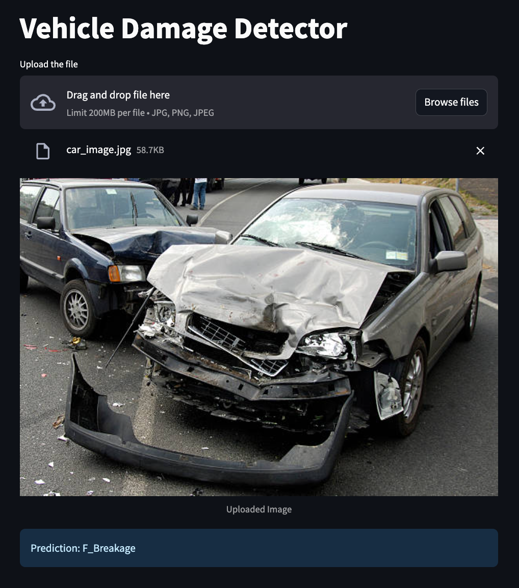
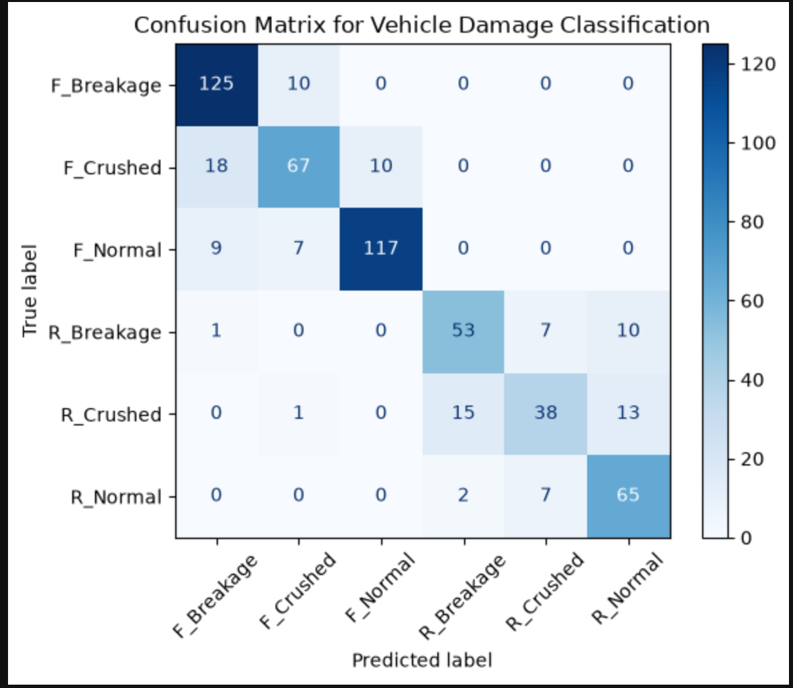

# Vehicle Damage Detection

A deep learning project for classifying vehicle damage from images. The project includes a trained PyTorch model, training notebooks, a labeled image dataset, and a Streamlit app for uploading a car image and getting a damage prediction.

## What This Project Does

The model predicts one of six vehicle condition classes:

| Class | Meaning |
| --- | --- |
| `Front_Breakage` | Front-side breakage damage |
| `Front_Crushed` | Front-side crushed damage |
| `Front_Normal` | Front side with no visible damage |
| `Rear_Breakage` | Rear-side breakage damage |
| `Rear_Crushed` | Rear-side crushed damage |
| `Rear_Normal` | Rear side with no visible damage |

The Streamlit app accepts `.jpg`, `.jpeg`, and `.png` files, displays the uploaded image, and returns the predicted class.

## Project Structure

```text
vehicle-damage-prediction/
├── README.md
├── car_damage_detector.png
├── confusion_matrix.png
├── requirements.txt
├── VROOM_Car_Damage_SOW_file.pdf
├── streamlit-app/
│   ├── app.py
│   ├── model_helper.py
│   ├── requirements.txt
│   └── model/
│       └── saved_model.pth
└── training/
    ├── damage_prediction.ipynb
    ├── hyperparameter_tunning.ipynb
    ├── saved_model.pth
    └── dataset/
        ├── F_Breakage/
        ├── F_Crushed/
        ├── F_Normal/
        ├── R_Breakage/
        ├── R_Crushed/
        └── R_Normal/
```

## Tech Stack

- Python
- PyTorch
- Torchvision
- Streamlit
- Pillow
- ResNet-50 transfer learning

## Model Overview

The deployed model uses a ResNet-50 backbone from `torchvision.models`.

Implementation highlights:

- Starts from ImageNet pretrained ResNet-50 weights.
- Freezes the earlier layers.
- Fine-tunes `layer4` and the final classifier head.
- Replaces the final fully connected layer with dropout plus a linear layer for 6 classes.
- Resizes input images to `224 x 224`.
- Uses standard ImageNet normalization.

The deployed weights are stored at:

```text
streamlit-app/model/saved_model.pth
```

## Setup

Use a virtual environment. On macOS, avoid installing packages into the system/Homebrew Python because it can raise `externally-managed-environment`.

```bash
python3.12 -m venv .venv
source .venv/bin/activate
python -m pip install --upgrade pip
python -m pip install -r requirements.txt
```

Verify that Python is coming from the virtual environment:

```bash
which python
python --version
```

Expected path should include `.venv`.

## Run the Streamlit App

From the project root:

```bash
cd streamlit-app
streamlit run app.py
```

Then open the local URL shown in the terminal, usually:

```text
http://localhost:8501
```

Upload a vehicle image and the app will display the predicted damage category.

### Streamlit App Preview



## Training

Training and experimentation are included in the `training/` directory:

- `damage_prediction.ipynb`: main model development notebook.
- `hyperparameter_tunning.ipynb`: hyperparameter tuning experiments.
- `dataset/`: labeled image folders used for supervised training.
- `saved_model.pth`: saved model weights from training.

Dataset classes follow the folder names:

```text
F_Breakage
F_Crushed
F_Normal
R_Breakage
R_Crushed
R_Normal
```

The Streamlit app maps these to user-facing labels:

```text
Front_Breakage
Front_Crushed
Front_Normal
Rear_Breakage
Rear_Crushed
Rear_Normal
```

## Model Evaluation

The final ResNet-50 model evaluation in `training/damage_prediction.ipynb` reports `81%` validation accuracy across `575` validation images.

### Classification Report

| Class | Precision | Recall | F1-score | Support |
| --- | ---: | ---: | ---: | ---: |
| `F_Breakage` | 0.82 | 0.93 | 0.87 | 135 |
| `F_Crushed` | 0.79 | 0.71 | 0.74 | 95 |
| `F_Normal` | 0.92 | 0.88 | 0.90 | 133 |
| `R_Breakage` | 0.76 | 0.75 | 0.75 | 71 |
| `R_Crushed` | 0.73 | 0.57 | 0.64 | 67 |
| `R_Normal` | 0.74 | 0.88 | 0.80 | 74 |
| **Accuracy** |  |  | **0.81** | **575** |
| **Macro avg** | 0.79 | 0.78 | 0.78 | 575 |
| **Weighted avg** | 0.81 | 0.81 | 0.81 | 575 |

### Confusion Matrix

Rows are true labels and columns are predicted labels.



| True \ Predicted | `F_Breakage` | `F_Crushed` | `F_Normal` | `R_Breakage` | `R_Crushed` | `R_Normal` |
| --- | ---: | ---: | ---: | ---: | ---: | ---: |
| `F_Breakage` | 125 | 10 | 0 | 0 | 0 | 0 |
| `F_Crushed` | 18 | 67 | 10 | 0 | 0 | 0 |
| `F_Normal` | 9 | 7 | 117 | 0 | 0 | 0 |
| `R_Breakage` | 1 | 0 | 0 | 53 | 7 | 10 |
| `R_Crushed` | 0 | 1 | 0 | 15 | 38 | 13 |
| `R_Normal` | 0 | 0 | 0 | 2 | 7 | 65 |

## Requirements

The root `requirements.txt` contains:

```text
streamlit==1.40.2
Pillow>=10.4.0
torch==2.5.1
torchvision==0.20.1
```

For Apple Silicon or Intel macOS, use the standard PyTorch packages above. Do not use CUDA-specific package names such as `torch==2.5.1+cu118` unless you are installing on a compatible NVIDIA CUDA environment.

## Future Improvements

- Add confidence scores to Streamlit predictions.
- Show top-3 predicted classes.
- Add Grad-CAM visual explanations for model decisions.
- Add automated tests for image preprocessing and model loading.
- Package the app for deployment on Streamlit Community Cloud or Docker.

## License

No license file is currently included. Add a license before publishing or sharing this repository publicly.
